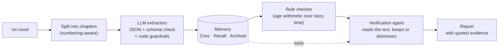

# Webfic Checker

A consistency checker for Chinese web novels (网文). It reads a novel chapter by
chapter, extracts what the text states about characters and the passage of story time,
and flags contradictions — "18 in chapter 3, then 16 two years later" — for the author to
review. A verification agent then goes back to the text and dismisses the reports that
turn out to be false alarms, so the author sees the few that matter.

It flags, it does not correct: many apparent contradictions are deliberate (a
flashback, an unreliable narrator, a twist), so every report comes with the quoted
evidence and the author decides.

**Status:** a working command-line pipeline with a self-built agent harness and an
evaluation harness; the web UI, multi-user deployment and more checkers (timeline,
personality, world rules) are on the roadmap. The project doubles as a portfolio piece
for AI application / agent engineering: most of the work went into making each step
measurable.

## Results

| What | How it is measured | Result |
|---|---|---|
| **Verification agent, real reports** (held out) | 22 contradiction reports on real novels, labelled by hand; 3 runs each | **97% correct**; the 19 false alarms dismissed in 56 of 57 runs (the other ran out of turns and stayed visible); the author's report goes from 22 items to 1–2, keeping the one real candidate every time |
| Verification agent, real contradictions | 47 contradictions (test stories + contradictions injected into real novels); 3 runs | 93% kept (6% wrongly dismissed — about half of those are injected test cases the text itself marks as unreliable) |
| Verification agent, false alarms | 73 false alarms made by corrupting stored extraction results without touching the text; 3 runs | **100% dismissed** |
| Long chapters (9–18k characters) | the same novels with every three chapters merged | no degradation: 100% / 100% on the two sets above; 98% of stated ages still extracted |
| Age extraction on real text | 20 hand-annotated chapters from 19 novels, 5 samples | recall 99%, precision 92%, traps passed 96% |
| Contradiction detection | 88 contradictions injected into 100 real novels | 85% detected (90% on an earlier sample), every confidence level right; 0 false reports on 122 control edits |
| Passage retrieval | own test stories / 24 annotated DetectiveQA novels | hit@5 100% / clue statements hit@5 73%, hit@10 81% |
| Cost | DeepSeek, platform prices | extraction ≈ $0.25–0.3 per million characters; verification ≈ $0.003 per report |

The numbers, and how each was reached, are discussed in [Evaluation](#evaluation).

## How it works



1. **Chapter splitting.** Headings are recognised by the continuity of their numbering,
   not by length or a single regex, so "第一回合比赛，开始！" in the middle of a chapter
   stays body text while "第一卷 第七章 浮游世界" and author typos in chapter numbers
   are handled (checked on 100 WebNovelBench novels).
2. **Extraction.** A cheap model (`deepseek-flash`, thinking off, temperature 0) reads
   each chapter in ≤8,000-character chunks and returns ages, time spans and revealed
   real names as JSON, validated with Pydantic and retried with the error message on
   failure. Two rules shaped the prompt and the code around it:
   - *label, don't omit*: the model tags a time span as advance / short / retrospective
     / future and an age as speculative or generic, rather than being told to leave
     things out — models label more reliably than they omit;
   - *formal errors are fixed in code*: every quote must be found in the text, a
     "years ago" offset must quote the text that states it, "N年" without "岁" is not
     an age, "再过 / 至少 / 打算…" turns an advance into a future span, group and
     kinship words never become character names.
3. **Memory**, in three layers (after Letta/MemGPT), each exposed as queries that later
   became agent tools:
   - *Core*: each character's latest state, with a snapshot after every chapter;
   - *Recall*: a generic fact table (category / attribute / value / qualifiers) — ages
     today, appearance or titles later — and the book's time spans;
   - *Archival*: 500-character passages searched by pgvector embeddings (local
     `bge-small-zh`) and jieba keywords, merged with reciprocal rank fusion.
4. **Checking.** A rule-based checker turns each age into a birth-time range and compares
   neighbouring statements across the story time that passes between them. It knows
   flashbacks, approximate ages and unquantified jumps ("多年以后").
5. **Verification.** An agent re-reads the evidence of each reported contradiction and
   decides: real contradiction, false alarm, or for the author to judge (below).
6. **Chapter management.** Append, replace, delete or patch a chapter; everything from
   that chapter on is recomputed — character merges and renames are undone through a
   change log, the Core rolls back to the previous snapshot, and unchanged chapters
   reuse their stored extraction, so a recomputation only pays for (and only varies
   in) what changed. Every operation has a **dry run**: it runs inside a transaction
   that is rolled back and reports the contradictions the edit would add or remove.

## The agent harness

Built from scratch (no LangGraph or similar) in [`backend/src/webfic/agent/`](backend/src/webfic/agent):

- **Tool registry** — a tool is a Pydantic argument model, a description and a
  function; the JSON Schema the model sees is generated from the model. The user and
  the book are injected by the harness, never arguments, and unknown arguments are
  rejected — the model cannot ask for anyone else's data.
- **Loop** — native function calling, ReAct style. Everything the model gets wrong
  (invalid arguments, unknown tools, "not found", an answer the guard rejects) goes
  back to it as a tool result.
- **Budget** — turns, the size of a single request, and cost. A run that runs out gives
  no answer, and for the verification agent that means the report stays visible: it
  never dismisses by default.
- **Guard** — a code check on the submitted answer: every quoted piece of evidence must
  be found in the text, and a dismissal is only accepted if the agent actually read the
  text in this run.
- **Working memory** — old tool results are folded into one-line notes after two turns
  (the tools are read-only, so the model can ask again); the model is told each turn how
  many turns it has used. This, not truncating long chapters, is what keeps long and
  complicated books within budget without losing evidence.
- **Execution records** — every model call, tool call and guard decision is stored as
  an OpenTelemetry-shaped span (`agent_runs`, `agent_steps`) and can be read back
  (abridged, translated output):

```text
$ webfic trace b8fabccc
verify  done  4 turns / 6 tool calls / in 14655 out 739 tokens / $0.0013
1. llm deepseek-flash   → read_passage {"chapter": 1, "start": 128, "end": 134}
                        → read_passage {"chapter": 4, "start": 46, "end": 54}
2. tool read_passage    …两人刚走到山脚，就看见【一个白发老者】坐在茶摊边上…
3. tool read_passage    "【年方三十的赵无极】，"说书先生在茶摊边上拍着醒木，"当年一人一剑，守住了青云山门！"
4. llm deepseek-flash   "chapter 4 … is spoken by a storyteller, describing a past event"
…
9. llm deepseek-flash   → submit_verdict
结论：false_alarm (past_event) — 第4章的「年方三十」是说书人在讲述赵无极当年守山门的往事……
      并非当下的年龄；第1章的「白发老者」才是他现在的样貌，两者并不冲突。
```

(From one of the project's own test stories: the checker compared an age from an old
story told by a storyteller with the character's present; the agent reads both
passages, finds "当年", and dismisses the report, quoting the line.)

The **verification agent** ([`agent/verify.py`](backend/src/webfic/agent/verify.py))
uses five read-only memory tools — read a passage, search the book, look up a character,
list a character's facts, list time spans — and one tool to submit a verdict with a
reason (misattributed, past event, flashback, guess, time span misread…), an explanation
for the author and quoted evidence. Its prompt sets a bar for dismissing: **only when the
text itself states why the age does not count**. Anything that rests on inference — "more
years must have passed", "the author is probably exaggerating" — goes to the author
instead. The first prompt, without that bar, wrongly dismissed 15% of real contradictions
with plausible-sounding reasons; the rule halved that without losing any dismissals of
real false alarms.

## Evaluation

`webfic-eval` ([`backend/src/webfic/evaluation/`](backend/src/webfic/evaluation)) holds
one harness per question, each with baselines, multi-sample runs that bypass the LLM
cache, and replay from the cache for re-scoring without cost.

| Command | Question | Data |
|---|---|---|
| `run` | Does extraction + checking find the planted contradictions, and nothing else? | 6 hand-written test stories with machine-readable answers; one held out, written by a different author, never looked at when tuning prompts |
| `realtext` | How good is extraction on real text? | 20 chapters from 19 novels, every age and time span annotated; recall, precision, traps, stability over 5 samples; sequential vs single-chapter reading |
| `inject` | Can the pipeline catch a contradiction in a real novel? | Code edits real novels — changes an age or inserts one that contradicts the story so far — and the edit runs as a dry run; control edits (consistent ages, flashbacks, guesses, future durations) must not be reported |
| `verify` | Does the verification agent keep real contradictions and dismiss false ones? | Real contradictions (test stories + injections); false alarms made by corrupting stored extraction results while leaving the text alone (a flashback marked as present, a guess marked as fact, an age moved to another character…); 22 hand-labelled real reports, held out |
| `long-chapters` | Does anything break on 10,000-character chapters? | The same novels with every three chapters merged |
| `retrieval` | Does search find the right passage? | Questions on the test stories; DetectiveQA's annotated clues |

Some things the evaluations caught, that unit tests with a fake model could not:

- **Rereading is not free of noise.** The same chapter read twice gives about a quarter
  different facts, so "recompute everything after an edit" mixed unrelated changes into
  the report. Stored extractions are now reused for unchanged chapters.
- **Future durations looked like the story moving on.** Half of the injected "再过三年…"
  sentences produced a false contradiction; a `future` label and a code rule brought
  that to zero, measured on a second set of sentences written beforehand and never used
  for tuning.
- **Aggregate numbers hid what mattered.** Long chapters seemed to lose 31% of the ages;
  split by type, stated ages were kept at 98% and only repeated "少年" mentions were lost.
- **The labels were wrong too.** The agent kept dismissing one of the planted
  contradictions in a test story; the text says the age was "当年" — it was the
  hand-written answer key that was wrong. Test cases generated by code had the same
  problem ("超过百岁" read as exactly 100). Both are now fixed or reported case by case,
  and the published numbers include the remaining questionable cases.

Test stories, annotations and external corpora (WebNovelBench, DetectiveQA, 蜀山剑侠传)
are kept out of the repository for copyright reasons; tests that need them are skipped
when they are missing.

## Getting started

Requirements: Docker, Python 3.12+, [uv](https://docs.astral.sh/uv/), a DeepSeek API key
(or another OpenAI-compatible provider).

```bash
cp .env.example .env              # set WEBFIC_LLM_API_KEY
docker compose up -d postgres     # Postgres 16 with pgvector
cd backend
uv sync
uv run alembic upgrade head
uv run pytest                     # 280 tests, no API calls
```

On Windows, run the CLI with `PYTHONUTF8=1`.

```bash
uv run webfic ingest novel.txt            # split → extract → check → verify
uv run webfic report <book>               # the report (--all: dismissed ones too)
uv run webfic verify <book>               # verify issues not verified yet
uv run webfic trace <run>                 # what the agent did, step by step
uv run webfic patch <book> 12 "十六岁" "十八岁" --dry-run   # what would an edit change?
uv run webfic append <book> new.txt       # add chapters (also replace-chapter, delete-chapter)
uv run webfic character <book> 林远       # a character's state, as of any chapter
uv run webfic search <book> "林远 拜师"   # passage search
uv run webfic usage <book>                # tokens and cost
```

Books, runs and issues can be referred to by a unique prefix of their id.

## Project layout

```
backend/src/webfic/
  ingest/        chapter splitting, chunking
  extraction/    prompts (versioned), extractor, quote locator, character resolver
  memory/        Core state and snapshots, change log, Recall and Archival queries
  archival/      passages, local embeddings, jieba keywords, indexing
  checkers/      age arithmetic checker
  agent/         harness (tools, loop, budget, trace) and the verification agent
  llm/           provider-neutral client: caching, usage ledger, retries, function calling
  services/      entry-point-independent business logic (import, chapters, checks,
                 verification, reports) — the CLI is a thin shell over these
  evaluation/    webfic-eval
backend/alembic/ migrations
backend/tests/   unit tests on SQLite with fake models, plus Postgres integration tests
```

Every business table carries `user_id` (and `book_id`), and every query filters on it,
in preparation for the multi-user service.

## Roadmap

- **Next:** timeline and semantic checkers (personality shifts, world rules) as agents
  on the same harness, with LLM-as-judge evaluation calibrated by hand; multi-step
  retrieval on DetectiveQA.
- **Then:** an MCP server exposing the same tools; a minimal web UI with the report and
  an agent-trace viewer; a revision agent that proposes the smallest edit for a
  contradiction and verifies it with a dry run before the author accepts it.
- **Before launch:** accounts and data isolation, bring-your-own-key, usage credits,
  background workers, deployment.
